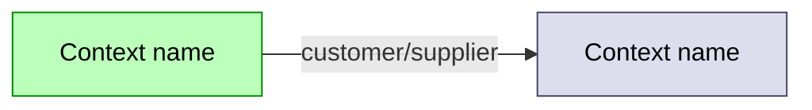
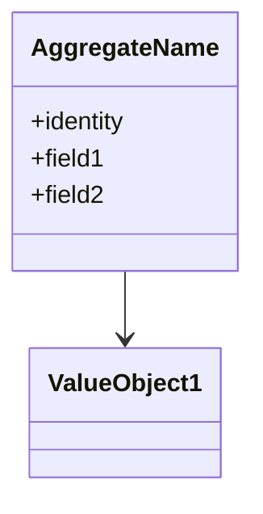

# DDD Architecture Snapshot

Generate a top-level architecture document by reading the project's DDD corpus and only the DDD corpus. Output a current-state snapshot — not a changelog, not a roadmap, not annotated history.

## Hard rules — read these first

**This skill reads from the corpus and writes one file. Nothing else.**

**ALLOWED reads:**
- `<docs-root>/CONTEXT_MAP.md`
- `<docs-root>/UBIQUITOUS_LANGUAGE.md`
- `<docs-root>/contexts/**/CONTEXT.md`
- `<docs-root>/contexts/**/adrs/*.md`
- `<docs-root>/adrs/*.md`
- `<docs-root>/specs/*.md`
- Any `<docs-root>/*.md` whose body contains the headings "Bounded Context", "Aggregate", or "Invariant" (these are DDD-shaped specs in projects that don't use the canonical `contexts/<name>/` layout)

**FORBIDDEN reads** (do not read these even if the corpus is sparse — they would corrupt the snapshot with non-DDD content):
- Anything outside `<docs-root>/`
- Source code (`src/`, `lib/`, `app/`, `pkg/`, etc.)
- Tests
- Build/runtime config (`package.json`, `wrangler.toml`, `pyproject.toml`, etc.)
- Top-level `README.md`, `CLAUDE.md`, `CHANGELOG.md`
- Git history (no `git log`, no `git blame`, no `git diff`)
- Anything under `<docs-root>/reference/` unless the user explicitly says to include it (reference material is sibling-product context, not this project's DDD)

If a question can only be answered by reading a forbidden source, the answer is "the corpus does not say" — record it in the **Drift & Open Questions** section. Never invent.

**Writes**: exactly one file, `<docs-root>/ddd-architecture.md`. Overwrites on each run.

## Process

### 1. Discover the corpus

Walk the allowed paths in order. Build an in-memory manifest: `{path, headings, has_bounded_contexts, has_aggregates, has_invariants}`.

**Enumerate every file you walk.** The §Source manifest in the output MUST list every file you opened — including ones you ultimately skipped — with a one-line note explaining the disposition (full content, title only, skipped). A reader should never have to ask "did the skill see this file?". Do not bury this list inside §Notes on corpus shape; it belongs at the top.

**Slice docs vs spec docs.** Files named `<feature>-slices.md` (or anything with §Slice headings) elaborate an existing bounded context, they don't introduce new ones. Fold their invariants, aggregates, and acceptance criteria into the relevant context's section in the synthesis — do not skip them, and do not create a new bounded-context row for them. If a slice doc materially extends an aggregate (new invariant, new value object), surface it in the aggregate's §Key invariants list with a citation to the slice file.

If `CONTEXT_MAP.md` exists, treat it as authoritative for context boundaries. If it doesn't exist:

- Find the spec-shaped document(s) with both "Bounded Context" and "Aggregate" headings.
- The largest such document is the **canonical spec** — its "Bounded Contexts" section becomes the backbone.
- Other spec-shaped documents that introduce new bounded contexts (e.g., a substrate spec, a governance spec) are treated as additional contexts at the same level.

If neither layout yields bounded contexts, stop and write a one-section output explaining what was found and what's missing. Do not fabricate contexts to fill space.

### 2. Identify and classify

For each bounded context, extract from the corpus:

- **Role** — core / supporting / generic. If the spec explicitly says (e.g., "core" in a heading), use that. If not, infer only from explicit corpus language ("this is the core domain", "this is supporting infrastructure"). If the corpus is silent, mark **unspecified** — do not guess.
- **Status** — live / spec / deferred / unspecified. Derived from explicit corpus markers ("Phase A shipped", "deployed", "Phase G-1 unbuilt", "deferred", "exploration document"). When the corpus is silent for a context, write **unspecified**. Do not infer status from absence — only from explicit statements.
- **Responsibilities** — one or two lines, paraphrased from the context's own responsibility section.
- **Aggregates** — the §Aggregate or §Tactical Design subsections. For each: identity type, key invariants by id (P1, P2, S3, etc. — preserve the corpus's numbering), commands list, domain events list.
- **Relationships to other contexts** — read the §Context Map or equivalent; categorize each edge as Customer/Supplier, Shared Kernel, ACL, Conformist, OHS, Partnership, or Published Language. If the corpus uses other terminology, preserve it verbatim.

**Uniform aggregate template.** Apply the same shape to every aggregate in §Aggregates: `Identity` + `Key invariants` + `Commands` + `Domain events`. If a spec omits one of these for an aggregate (e.g., the corpus doesn't list domain events for HarvestJob), either:
- write the field with a single bullet `(not enumerated in the corpus)` so the missing data is visible, OR
- declare at the section level (one line under the §Aggregates heading) which fields are uniformly abbreviated and why.
Do not silently omit fields for some aggregates and include them for others — mixed coverage looks like the skill skipped something.

For ADRs: title, status, one-sentence decision, reversibility note (if the ADR has a §Reversibility section).

For the ubiquitous language: do not duplicate it in the output. Link to the file.

### 3. Surface drift

Scan for:

- Terms that appear in `UBIQUITOUS_LANGUAGE.md` with one definition and in a spec with a different definition.
- The same aggregate referenced under different names across specs.
- Open Questions sections inside any spec that haven't been resolved (no answer + no ADR).
- Bounded contexts mentioned in one spec but missing from the canonical context list.
- **Spec-vs-live divergences**: invariants stated in a spec that an ADR records as deferred or implemented differently in the live system (e.g., "spec §7.5 calls for X; ADR 003 records the live choice as Y; spec wins on paper, ADR wins in practice"). Surface as its own bullet category so a reader sees where the spec and the deployed system are out of sync.

List each finding once in **Drift & Open Questions** with the file path(s) involved. Do not attempt to resolve them — that's `/domain`'s job.

### 4. Write `<docs-root>/ddd-architecture.md`

Use the template below. Every section is required; if a section has no content, write a single line saying so (e.g., "No ADRs in the corpus.") rather than omitting it.

<output-template>

# DDD Architecture

Snapshot generated YYYY-MM-DD. This document captures the current state of the project's domain model as described by the DDD corpus. It is not a changelog and contains no historical narrative — re-run `/ddd-architecture` to refresh.

## Source manifest

Every file inspected, grouped by disposition. A reader must never wonder "did the skill see this?".

**Full content read** (unpacked into §Bounded Contexts / §Aggregates / §Cross-Cutting):

- `docs/CONTEXT_MAP.md` (if present)
- `docs/UBIQUITOUS_LANGUAGE.md`
- `docs/contexts/<name>/CONTEXT.md` × N (if present)
- `docs/adrs/*.md` × N
- `docs/specs/*.md` × N — both spec docs AND slice docs; slice content folds into the relevant context
- `docs/<spec>.md` × N (DDD-shaped specs at the docs root)

**Title only** (corpus file exists but its content didn't fit a bounded-context or cross-cutting bucket): list each with a one-line reason — methodology document, formal grammar, sub-spec of an existing context, etc.

**Skipped** (deliberately): list each with a one-line reason. Most common is `docs/reference/**` (sibling-product reference material, excluded by the skill's hard rules).

## Overview

One paragraph (≤6 sentences) synthesized from the canonical spec's vision / intent / purpose sections. Use the corpus's own phrasing where possible; quote only when a single phrase is doing definitional work.

## Bounded Contexts

| Context | Role | Status | Responsibilities | Owning aggregates | Spec |
|---|---|---|---|---|---|
| ... | core / supporting / generic / unspecified | live / spec / deferred / unspecified | ... | ... | `docs/<file>.md` §N |

## Context Map



## Aggregates

### <Context name>

#### <Aggregate name>

- **Identity**: `IdentityType`
- **Key invariants**:
  - **P1** — invariant text (verbatim or close paraphrase from the spec)
  - **P2** — ...
- **Commands**: `Command1`, `Command2`, ...
- **Domain events**: `Event1`, `Event2`, ...



(Only include the classDiagram when the aggregate has 2+ value objects worth showing. Otherwise skip — diagrams that show one box add noise.)

## Cross-Cutting Concerns

Anything the corpus identifies as spanning multiple contexts: audit chains, identity, shared kernels, event buses, common infrastructure. One subsection per concern, each ≤5 lines, naming which contexts it touches and which spec defines it.

If the corpus has none, write: "No cross-cutting concerns identified in the corpus."

## ADR Ledger

| # | Title | Status | Decision (1 line) | Reversibility |
|---|---|---|---|---|
| 001 | ... | Accepted YYYY-MM-DD | ... | low / medium / high / not stated |

## Ubiquitous Language

The canonical glossary lives at `docs/UBIQUITOUS_LANGUAGE.md`. This document does not duplicate it.

## Drift & Open Questions

Findings from cross-referencing the corpus. Each finding names the files involved and quotes the conflicting passages without resolving them.

- **Term drift**: `<term>` defined as `<X>` in `<file-a>` and as `<Y>` in `<file-b>`.
- **Unresolved**: `<file>.md` §N records an Open Question with no answer and no corresponding ADR.
- ...

If nothing was found, write: "No drift or unresolved questions detected in this pass."

## Notes on corpus shape

(Optional section, only when the corpus deviates from the canonical layout.)

What was expected but not found: `<path>`. The synthesis used `<fallback source>` as the backbone instead.

</output-template>

## Mermaid discipline

These rules apply to every mermaid block emitted:

1. **No quotation marks** anywhere inside node labels, edge labels, or class names. If a corpus term contains punctuation, paraphrase to remove it (e.g., `Customer/Supplier` becomes `customer-supplier`).
2. **Every `classDef` must include `color:#000`** so text on coloured fills stays readable. Default palette:
   - `core` — `fill:#bfb,stroke:#080,color:#000`
   - `support` — `fill:#dde,stroke:#446,color:#000`
   - `generic` — `fill:#eee,stroke:#888,color:#000`
   - `unspec` — `fill:#fee,stroke:#a44,color:#000`
3. **Edge labels use the corpus's own relationship word** (Customer/Supplier → `customer-supplier`, Shared Kernel → `shared-kernel`, etc.). If the corpus invents a term, preserve it verbatim (minus punctuation per rule 1).
4. **Keep diagrams small**. A context map with 8+ nodes is fine; an aggregate diagram with 10 boxes is noise. If a diagram would have more than ~8 elements, prefer a table.
5. **Edge-style legend.** If a diagram uses more than one edge style (solid + dotted, different arrowheads, different label categories), include either a `%% Legend:` comment block at the bottom of the mermaid block OR a one-line legend immediately below the diagram explaining what each style means. The classDef-color legend doesn't carry edge semantics — they need their own callout.

   Example:
   ```mermaid
   flowchart TB
     A --> B
     C -.wraps.-> A
     %% Legend: solid = causal dependency; dotted = wraps or layered-atop relationship
   ```

## What this skill never does

- Read source code, tests, or config to "verify" a corpus claim.
- Add invariants, events, or contexts the corpus doesn't mention.
- Reference past phases ("Phase 0 shipped", "before the rewrite"). The output is a current-state snapshot; historical context belongs in the corpus, not the synthesis.
- Ask the user clarifying questions. The corpus is the only input. Ambiguities go into **Drift & Open Questions**.
- Modify any corpus file.

## Related skills

- `/domain` — interactive resolution of any drift this skill surfaced
- `/holistic` — broader system view that *can* read source code (this skill deliberately does not)
- `/spec` — authoring the corpus this skill reads
